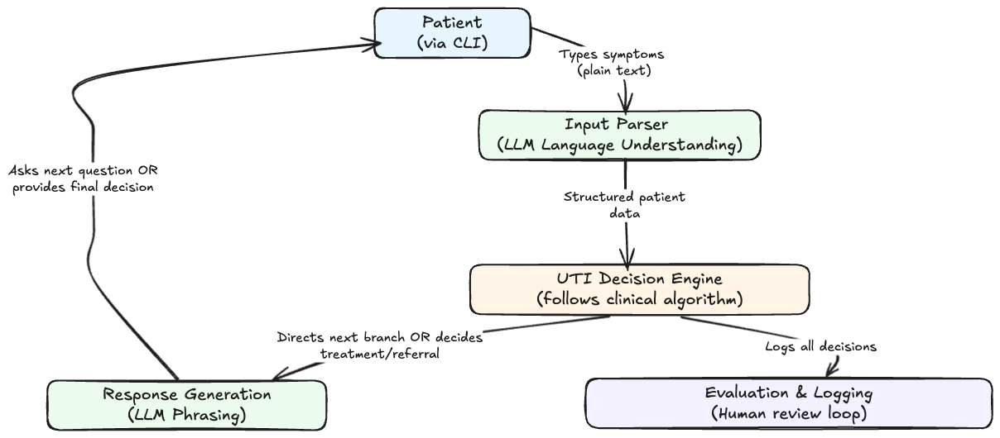

# Livewell UTI Agent

This AI agent automates routine urinary tract infection (UTI) treatment, providing immediate care for straightforward cases while ensuring complex cases are escalated to human clinicians. The system delivers prescription recommendations following established clinical guidelines without requiring appointments or wait times.

## How it works
- **Patient describes their symptoms in natural language** - they can type "I have burning sensation when I pee and need to go constantly" just like talking to a doctor
- **Language Understanding converts everyday language into medical data** - an LLM takes messy human descriptions and organizes them into clear, structured data (symptoms, severity, and so on)
- **Clinical Decision Engine follows clinical protocols** - applies the same [step-by-step guidelines](https://www.ocpinfo.com/wp-content/uploads/2022/12/assessment-prescribing-algorithm-urinary-tract-infection-english.pdf) that pharmacists and nurses use, checking for safety concerns and determining the right treatment
- **Response Generation explains the decision in plain English** - an LLM converts the medical recommendation back into clear instructions the patient can understand and follow
- **Evaluation & Logging captures everything for quality improvement** - records all interactions and decisions for future review and refinment of the system

The system prioritizes patient safety with built-in escalation protocols, ensuring complex cases receive appropriate human clinical oversight while autonomously handling routine cases that match established clinical protocols.

  

